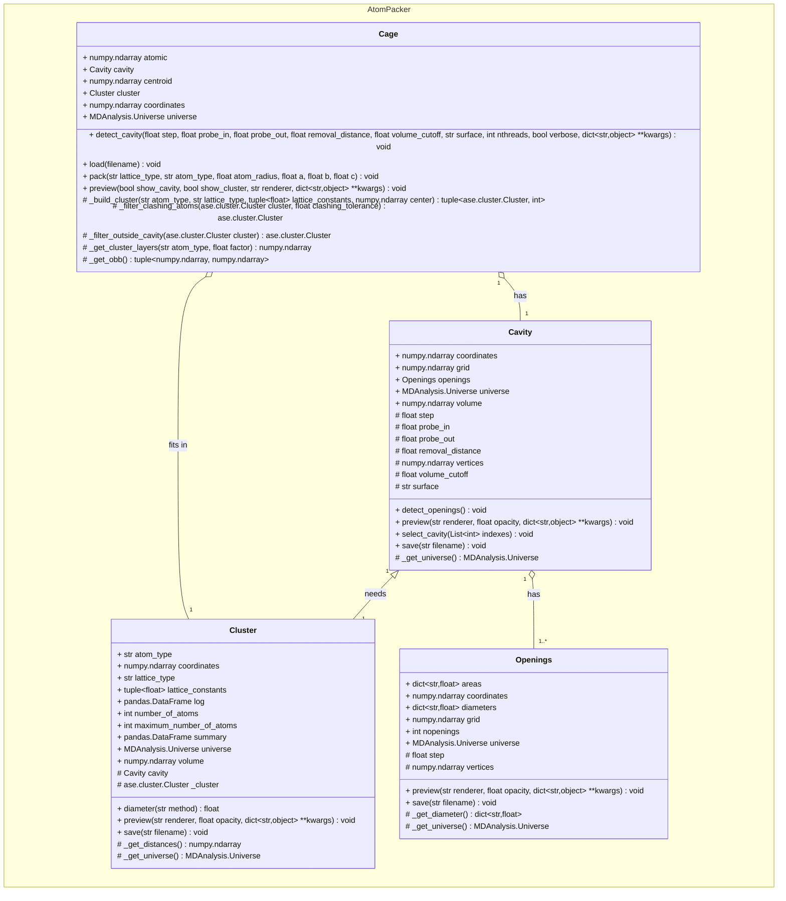

## Architecture

The package is organized as follows:

```mermaid
classDiagram
direction LR
Cage "1" o-- "1" Cavity : has
Cage "1" o-- "1" Cluster : fits in
Cavity "1" o-- "1..*" Openings : has
Cavity "1" <|-- "1" Cluster : needs
namespace AtomPacker {
class Cage {
+ numpy.ndarray atomic
+ Cavity cavity
+ numpy.ndarray centroid
+ Cluster cluster
+ numpy.ndarray coordinates
+ MDAnalysis.Universe universe
+ detect_cavity(float step, float probe_in, float probe_out, float removal_distance, float volume_cutoff, str surface, int nthreads, bool verbose, dict~str,object~ **kwargs) void
+ load(filename) void
+ pack(str lattice_type, str atom_type, float atom_radius, float a, float b, float c) void
+ preview(bool show_cavity, bool show_cluster, str renderer, dict~str,object~ **kwargs) void
# _build_cluster(str atom_type, str lattice_type, tuple~float~ lattice_constants, numpy.ndarray center) tuple~ase.cluster.Cluster, int~
# _filter_clashing_atoms(ase.cluster.Cluster cluster, float clashing_tolerance) ase.cluster.Cluster
# _filter_outside_cavity(ase.cluster.Cluster cluster) ase.cluster.Cluster
# _get_cluster_layers(str atom_type, float factor) numpy.ndarray
# _get_obb() tuple~numpy.ndarray, numpy.ndarray~
}
class Cavity {
+ numpy.ndarray coordinates
+ numpy.ndarray grid
+ Openings openings
+ MDAnalysis.Universe universe
+ numpy.ndarray volume
# float step
# float probe_in
# float probe_out
# float removal_distance
# numpy.ndarray vertices
# float volume_cutoff
# str surface
+ detect_openings() void
+ preview(str renderer, float opacity, dict~str,object~ **kwargs) void
+ select_cavity(List~int~ indexes) void
+ save(str filename) void
# _get_universe() MDAnalysis.Universe
}
class Cluster {
+ str atom_type
+ numpy.ndarray coordinates
+ str lattice_type
+ tuple~float~ lattice_constants
+ pandas.DataFrame log
+ int number_of_atoms
+ int maximum_number_of_atoms
+ pandas.DataFrame summary
+ MDAnalysis.Universe universe
+ numpy.ndarray volume
# Cavity cavity
# ase.cluster.Cluster _cluster
+ diameter(str method) float
+ preview(str renderer, float opacity, dict~str,object~ **kwargs) void
+ save(str filename) void
# _get_distances() numpy.ndarray
# _get_universe() MDAnalysis.Universe  
}
class Openings {
+ dict~str,float~ areas
+ numpy.ndarray coordinates
+ dict~str,float~ diameters
+ numpy.ndarray grid
+ int nopenings
+ MDAnalysis.Universe universe
# float step
# numpy.ndarray vertices
+ preview(str renderer, float opacity, dict~str,object~ **kwargs) void
+ save(str filename) void
# _get_diameter() dict~str,float~
# _get_universe() MDAnalysis.Universe
}
}
```
