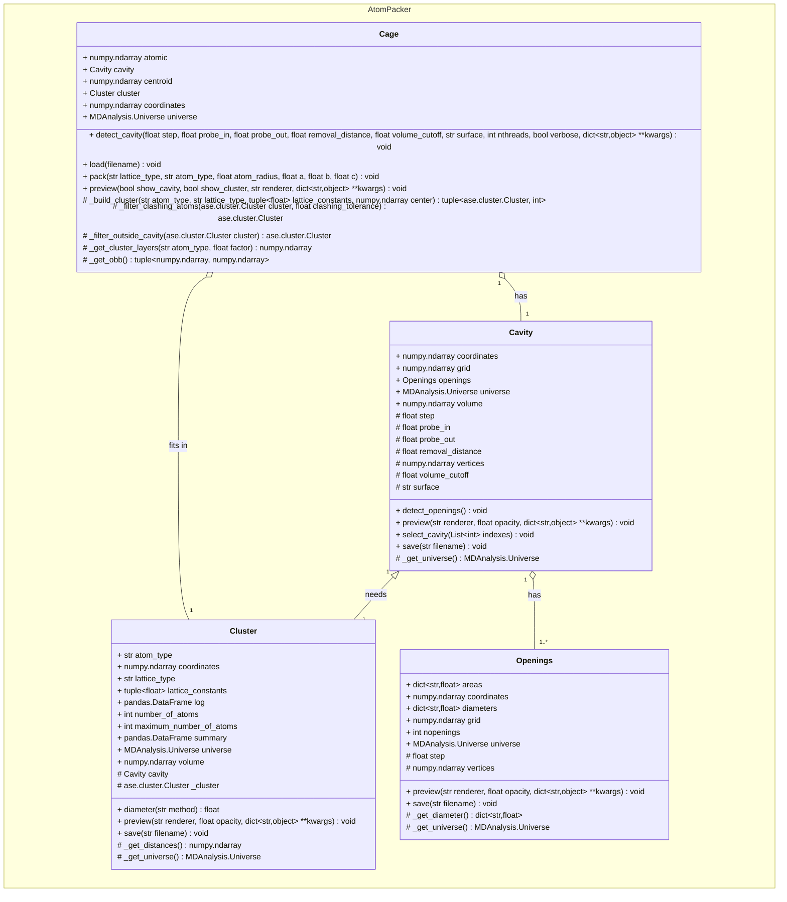

# AtomPacker

[](https://pypi.org/project/AtomPacker/)
[](https://pypi.org/project/AtomPacker/)
[](https://pypi.org/project/AtomPacker/)


A Python package for packing nanoclusters into supramolecular cages.

See also:

- [Documentation](https://cnpem.github.io/AtomPacker/)
- [GitHub repository](https://github.com/cnpem/AtomPacker/)
- [Issues](https://github.com/cnpem/AtomPacker/issues)

## Requirements

- [ASE](https://pypi.org/project/ase)
- [biopython](https://pypi.org/project/biopython)
- [MDAnalysis](https://pypi.org/project/MDAnalysis)
- [numpy](https://pypi.org/project/numpy)
- [plotly](https://pypi.org/project/plotly)
- [pyKVFinder](https://pypi.org/project/pyKVFinder)
- [scikit-learn](https://pypi.org/project/scikit-learn)
- [tqdm](https://pypi.org/project/tqdm)

## Installation

To install the latest release on [PyPI](https://pypi.org/project/AtomPacker/), run:

```bash
pip install AtomPacker
```

Or, to install the development version, run:

```bash
pip install git+https://github.com/cnpem/AtomPacker.git
```

## Usage

Packing nanoparticle atoms, based on ASE nanocluster, and filter atoms inside a target cavity.

```python
>>> from AtomPacker import Cage
# 1: Load structure from file
>>> cage = Cage()
>>> cage.load("tests/data/ZOCXOH.pdb")
# Uncomment to preview the cage structure.
>>> # cage.preview()
# 2: Detect cavity
>>> cage.detect_cavity(step=0.6, probe_in=1.4, probe_out=10.0, removal_distance=1.0, volume_cutoff=5.0)
# Uncomment to preview the cavity structure for detection quality control.
>>> # cage.cavity.preview()
# Show volume
>>> print(f"Cavity volume: {cage.cavity.volume} A^3")
# Uncomment to save the cavity structure.
>>> # cage.cavity.save("tests/cavity.pdb")
# 3: Detect openings in the cavity
>>> cage.cavity.detect_openings()
# Show openings areas
>>> print(f"Openings areas: {cage.cavity.openings.areas}")
# Show openings diameters
>>> print(f"Openings diameters: {cage.cavity.openings.diameters}")
# Uncomment to preview the openings structure for detection quality control.
>>> # cage.cavity.openings.preview()
# Uncomment to save the openings structure.
>>> # cage.cavity.openings.save("tests/openings.pdb")
# 4: Pack nanocluster into the cavity
>>> cage.pack(atom_type="Au", lattice_type="fcc", a=None, b=None, c=None)
# Uncomment to preview the cluster structure for quality control.
>>> # cage.cavity.preview()
# Uncomment to save the cluster structure.
>>> # cage.cluster.save("tests/cluster.pdb")
# Uncomment to preview the cage, cavity, openings and cluster structures.
>>> # cage.preview(show_cavity=True, show_cluster=True, show_openings=True)
# Show optimization details
>>> print(cage.cluster.number_of_atoms)
# Show summary
>>> print(cage.cluster.summary)
```

## Architecture

The package is organized as follows:



## Citing

If you find `AtomPacker` useful for you, please cite the following references:

- Guerra, J. V. S., Ribeiro-Filho, H. V., Jara, G. E., Bortot, L. O., Pereira, J. G. C., & Lopes-de-Oliveira, P. S. (2021). pyKVFinder: an efficient and integrable Python package for biomolecular cavity detection and characterization in data science. BMC bioinformatics, 22(1), 607. https://doi.org/10.1186/s12859-021-04519-4.

- (manuscript in preparation) Guerra, J. V. S., Jara, G. E., Lopes-de-Oliveira, P. S. & Szalóki, G. (2024) Modellization of confined nanoparticles.

## License

The software is licensed under the terms of the GNU General Public License version 3 (GPL3) and is distributed in the hope that it will be useful, but WITHOUT ANY WARRANTY; without even the implied warranty of MERCHANTABILITY or FITNESS FOR A PARTICULAR PURPOSE. See the GNU General Public License for more details.
