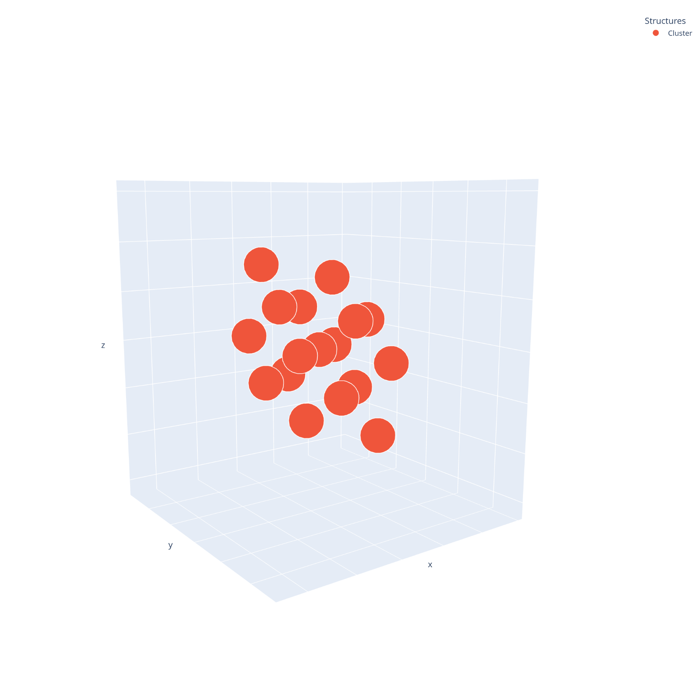

========
Tutorial
========

This section provides a tutorial on how to use the AtomPacker package to pack nanoparticle atoms inside a target supramolecular cage. For detailed reference documentation of the functions and classes contained in the package, see the `API reference <api.html>`_.

In this example, we will use the `ZOCXOH <https://www.ccdc.cam.ac.uk/structures/Search?Ccdcid=ZOCXOH>`_ cage structure from the `ZOCXOH.pdb <https://github.com/cnpem/AtomPacker/blob/main/tests/data/ZOCXOH.pdb>`_ file.

1. Load cage structure
======================

First, import **AtomPacker** package on Python and create a AtomPacker.Cage object:

.. code-block:: python

    >>> import AtomPacker
    >>> cage = AtomPacker.Cage()

The ``Cage`` object will be used to load the cage structure from the PDB file (eg., `ZOCXOH.pdb <https://github.com/cnpem/AtomPacker/blob/main/tests/data/ZOCXOH.pdb>`_):

.. code-block:: python

    >>> cage.load('ZOCXOH.pdb')
    
If you want to preview the cage structure, you can use the `Cage.preview <api.html#AtomPacker.Cage.preview>`_ method.

.. code-block:: python

    >>> cage.preview()

.. image:: _static/cage-preview-1.png
    :width: 600
    :align: center

2. Detect cavity
================

Next, we will detect the cavity inside the cage structure. The `Cage.detect_cavity <api.html#AtomPacker.Cage.detect_cavity>`_ method will detect the cavity using the `pyKVFinder <https://lbc-lnbio.github.io/pyKVFinder/_api_reference/detect.html>`_ detection parameters (``step``, ``probe_in``, ``probe_out``, ``removal_distance``, ``volume_cutoff``, ``surface``).

.. code-block:: python
    
    >>> cage.detect_cavity(step=0.6, probe_in=1.4, probe_out=10.0, removal_distance=1.0, volume_cutoff=5.0)

The detected cavity will be stored in the ``cavity`` attribute of the Cage object. 

If you want to preview the cavity structure for quality control in your cavity detection, you can use the `Cavity.preview <api.html#AtomPacker.Cavity.preview>`_ method.

.. code-block:: python

    >>> cage.cavity.preview()

.. image:: _static/cavity-preview.png
    :width: 600
    :align: center

You can access the cavity coordinates using the ``coordinates`` attribute of the Cavity object.

.. code-block:: python

    >>> print(cage.cavity.coordinates)
    [[-11.998       28.644       13.149     ]
     [-11.998       28.644       13.749     ]
     [-11.998       28.644       14.349     ]
     ...
     [ -1.1980003   30.443998    14.349     ]
     [ -1.1980003   30.443998    14.948999  ]
     [ -0.59800035  29.844       13.749     ]]

You can access the cavity grid using the ``grid`` attribute of the Cavity object.

.. code-block:: python

    >>> print(cage.cavity.grid)
    [[[-1 -1 -1 ... -1 -1 -1]
      [-1 -1 -1 ... -1 -1 -1]
      [-1 -1 -1 ... -1 -1 -1]
      ...
      [-1 -1 -1 ... -1 -1 -1]
      [-1 -1 -1 ... -1 -1 -1]
      [-1 -1 -1 ... -1 -1 -1]]

     [[-1 -1 -1 ... -1 -1 -1]
      [-1 -1 -1 ... -1 -1 -1]
      [-1 -1 -1 ... -1 -1 -1]
      ...
      [-1 -1 -1 ... -1 -1 -1]
      [-1 -1 -1 ... -1 -1 -1]
      [-1 -1 -1 ... -1 -1 -1]]

     [[-1 -1 -1 ... -1 -1 -1]
      [-1 -1 -1 ... -1 -1 -1]
      [-1 -1 -1 ... -1 -1 -1]
      ...
      [-1 -1 -1 ... -1 -1 -1]
      [-1 -1 -1 ... -1 -1 -1]
      [-1 -1 -1 ... -1 -1 -1]]

     ...

     [[-1 -1 -1 ... -1 -1 -1]
      [-1 -1 -1 ... -1 -1 -1]
      [-1 -1 -1 ... -1 -1 -1]
      ...
      [-1 -1 -1 ... -1 -1 -1]
      [-1 -1 -1 ... -1 -1 -1]
      [-1 -1 -1 ... -1 -1 -1]]

     [[-1 -1 -1 ... -1 -1 -1]
      [-1 -1 -1 ... -1 -1 -1]
      [-1 -1 -1 ... -1 -1 -1]
      ...
      [-1 -1 -1 ... -1 -1 -1]
      [-1 -1 -1 ... -1 -1 -1]
      [-1 -1 -1 ... -1 -1 -1]]

     [[-1 -1 -1 ... -1 -1 -1]
      [-1 -1 -1 ... -1 -1 -1]
      [-1 -1 -1 ... -1 -1 -1]
      ...
      [-1 -1 -1 ... -1 -1 -1]
      [-1 -1 -1 ... -1 -1 -1]
      [-1 -1 -1 ... -1 -1 -1]]]

You can access the cavity volume using the ``volume`` attribute of the Cavity object.

.. code-block:: python

    >>> print(cage.cavity.volume)
    531.58

You can also save the cavity structure using the `Cavity.save <api.html#AtomPacker.Cavity.save>`_ method.

.. code-block:: python

    >>> cage.cavity.save("cavity.pdb")

3. Detect cavity openings
=========================

Next, we will detect the openings of the cavity. The `Cage.Cavity.detect_openings <api.html#AtomPacker.Cage.detect_openings>`_ method will detect the openings.

.. code-block:: python

    >>> cage.cavity.detect_openings()

The detected openings will be stored in the ``openings`` attribute of the Cavity object. 

If you want to preview the openings structure, you can use the `Openings.preview <api.html#AtomPacker.Openings.preview>`_ method.

.. code-block:: python

    >>> cage.cavity.openings.preview()

You can access the openings coordinates using the ``coordinates`` attribute of the Openings object.

.. code-block:: python

    >>> print(cage.cavity.openings.coordinates)
    [[-11.998       28.644       13.149     ]
     [-11.998       28.644       13.749     ]
     [-11.998       28.644       14.349     ]
     [-11.398001    29.244       12.549     ]
     [-11.398001    29.244       13.149     ]
     [-11.398001    29.244       13.749     ]
     [-11.398001    29.244       14.349     ]
     [-11.398001    29.244       14.948999  ]
     [-11.398001    29.844       15.549     ]
     [-10.798       29.844       11.948999  ]
     [-10.798       29.844       12.549     ]
     [-10.798       29.844       13.149     ]
     [-10.798       29.844       13.749     ]
     [-10.798       29.844       14.349     ]
     [-10.798       29.844       14.948999  ]
     [-10.798       30.443998    14.349     ]
     [-10.798       30.443998    14.948999  ]
     [-10.798       30.443998    15.549     ]
     [-10.798       30.443998    16.149     ]
     [-10.198       30.443998    11.349     ]
     [-10.198       30.443998    11.948999  ]
     [-10.198       30.443998    12.549     ]
     [-10.198       30.443998    13.149     ]
     [-10.198       30.443998    13.749     ]
     [ -10.198       31.043999    10.749     ]
     ...
     [ -1.1980003   29.844       13.749     ]
     [ -1.1980003   30.443998    14.349     ]
     [ -1.1980003   30.443998    14.948999  ]
     [ -0.59800035  29.844       13.749     ]]

You can access the openings grid using the ``grid`` attribute of the Openings object.

.. code-block:: python

    >>> print(cage.cavity.openings.grid)
    [[[-1 -1 -1 ... -1 -1 -1]
      [-1 -1 -1 ... -1 -1 -1]
      [-1 -1 -1 ... -1 -1 -1]
      ...
      [-1 -1 -1 ... -1 -1 -1]
      [-1 -1 -1 ... -1 -1 -1]
      [-1 -1 -1 ... -1 -1 -1]]

     [[-1 -1 -1 ... -1 -1 -1]
      [-1 -1 -1 ... -1 -1 -1]
      [-1 -1 -1 ... -1 -1 -1]
      ...
      [-1 -1 -1 ... -1 -1 -1]
      [-1 -1 -1 ... -1 -1 -1]
      [-1 -1 -1 ... -1 -1 -1]]

     [[-1 -1 -1 ... -1 -1 -1]
      [-1 -1 -1 ... -1 -1 -1]
      [-1 -1 -1 ... -1 -1 -1]
      ...
      [-1 -1 -1 ... -1 -1 -1]
      [-1 -1 -1 ... -1 -1 -1]
      [-1 -1 -1 ... -1 -1 -1]]

     ...

     [[-1 -1 -1 ... -1 -1 -1]
      [-1 -1 -1 ... -1 -1 -1]
      [-1 -1 -1 ... -1 -1 -1]
      ...
      [-1 -1 -1 ... -1 -1 -1]
      [-1 -1 -1 ... -1 -1 -1]
      [-1 -1 -1 ... -1 -1 -1]]

     [[-1 -1 -1 ... -1 -1 -1]
      [-1 -1 -1 ... -1 -1 -1]
      [-1 -1 -1 ... -1 -1 -1]
      ...
      [-1 -1 -1 ... -1 -1 -1]
      [-1 -1 -1 ... -1 -1 -1]
      [-1 -1 -1 ... -1 -1 -1]]

     [[-1 -1 -1 ... -1 -1 -1]
      [-1 -1 -1 ... -1 -1 -1]
      [-1 -1 -1 ... -1 -1 -1]
      ...
      [-1 -1 -1 ... -1 -1 -1]
      [-1 -1 -1 ... -1 -1 -1]
      [-1 -1 -1 ... -1 -1 -1]]]

You can access the openings areas using the ``areas`` attribute of the Openings object.

.. code-block:: python

    >>> print(cage.cavity.openings.areas)
    {'OAA': 43.53, 'OAB': 41.04, 'OAC': 41.4, 'OAD': 44.74}

You can access the openings diameters using the ``diameters`` attribute of the Openings object.

.. code-block:: python

    >>> print(cage.cavity.openings.diameters)
    {'OAA': 7.444737563025417, 'OAB': 7.228675599024421, 'OAC': 7.260311091959885, 'OAD': 7.547498740076157}

You can also save the openings structure using the `Openings.save <api.html#AtomPacker.Openings.save>`_ method.

.. code-block:: python

    >>> cage.cavity.openings.save("openings.pdb")

4. Pack the nanocluster
=======================

Now that the cavity and its openings have been detected, you can pack nanoparticle atoms inside the cavity. Use the `Cage.pack <api.html#AtomPacker.Cage.pack>`_ method to pack atoms with the desired parameters (``atom_type``, ``lattice_type``, ``a``, ``b``, ``c``). For example, to pack a gold (``Au``) nanoparticle using a face-centered cubic (``fcc``) lattice.

.. code-block:: python

    >>> cage.pack(atom_type="Au", lattice_type="fcc", a=None, b=None, c=None, angles=[0.0], translations=[0.0])

.. note::

    To apply an optimization algorithm to the packed cluster, set angles and translations. Translations should be a list or numpy array of angles in degrees, and translations should be a list or numpy array of translation values in Angstroms. For example:

    .. code-block:: python
        
        angles = [-75, -50, -25, 0, 25, 50, 75]
        translations = [-0.2, 0.0, 0.2]

The packed cluster will be stored in the ``cluster`` attribute of the Cage object.

If you want to preview the cluster structure for quality control, you can use the `Cluster.preview <api.html#AtomPacker.Cluster.preview>`_ method.

.. code-block:: python

    >>> cage.cluster.preview()

Also, you can preview the cage, cavity, openings and cluster structure using the `Cage.preview <api.html#AtomPacker.Cage.preview>`_ method.

.. code-block:: python

    >>> cage.preview(show_cavity=True, show_cluster=True, show_openings=True)

.. image:: _static/cage-preview-2.png
    :width: 600
    :align: center

You can access the cluster coordinates using the ``coordinates`` attribute of the Cluster object.

.. code-block:: python

    >>> print(cage.cluster.coordinates)
    [[ -8.56353   25.718132  13.873403]
     [ -8.56353   27.758131  11.833403]
     [-10.60353   27.758131  13.873403]
     [-10.60353   29.798132  15.913403]
     [ -8.56353   27.758131  15.913403]
     [ -8.56353   29.798132  13.873403]
     [ -8.56353   29.798132  17.953403]
     [ -8.56353   31.838133  11.833403]
     [ -8.56353   31.838133  15.913403]
     [ -8.56353   33.87813   13.873403]
     [ -6.52353   25.718132  15.913403]
     [ -4.48353   25.718132  13.873403]
     [ -6.52353   29.798132  11.833403]
     [ -4.48353   27.758131  11.833403]
     [ -4.48353   29.798132   9.793403]
     [ -6.52353   27.758131  13.873403]
     [ -6.52353   29.798132  15.913403]
     [ -4.48353   27.758131  15.913403]
     [ -4.48353   29.798132  13.873403]
     [ -4.48353   29.798132  17.953403]
     [ -6.52353   31.838133   9.793403]
     [ -6.52353   33.87813   11.833403]
     [ -4.48353   31.838133  11.833403]
     [ -6.52353   31.838133  13.873403]
     [ -6.52353   33.87813   15.913403]
     [ -4.48353   31.838133  15.913403]
     [ -4.48353   33.87813   13.873403]
     [ -6.52353   31.838133  17.953403]
     [ -2.44353   29.798132  11.833403]
     [ -2.44353   27.758131  13.873403]
     [ -2.44353   29.798132  15.913403]
     [ -2.44353   31.838133  13.873403]]

You can also save the cavity structure using the `Cluster.save <api.html#AtomPacker.Cluster.save>`_ method.

.. code-block:: python

    >>> cage.cluster.save("cluster.pdb")

Finally, you can access the summary of the cluster using the ``summary`` attribute of the Cluster object.

.. code-block:: python

    >>> print(cage.cluster.summary)
                                     Au17
        Atom Type                      Au
        Atom Radius              1.441932
        Cavity Volume (ų)         531.58
        Diameter (maximum)         8.1568
        Diameter (shape)         5.994511
        Diameter (volume)        8.196339
        Lattice Constants          4.0784
        Lattice Type                  fcc
        Maximum Number of Atoms        43
        Number of Atoms                17

Also, you can access the optimization details using the ``log`` attribute of the Cluster object, using ``cage.cluster.log``.
